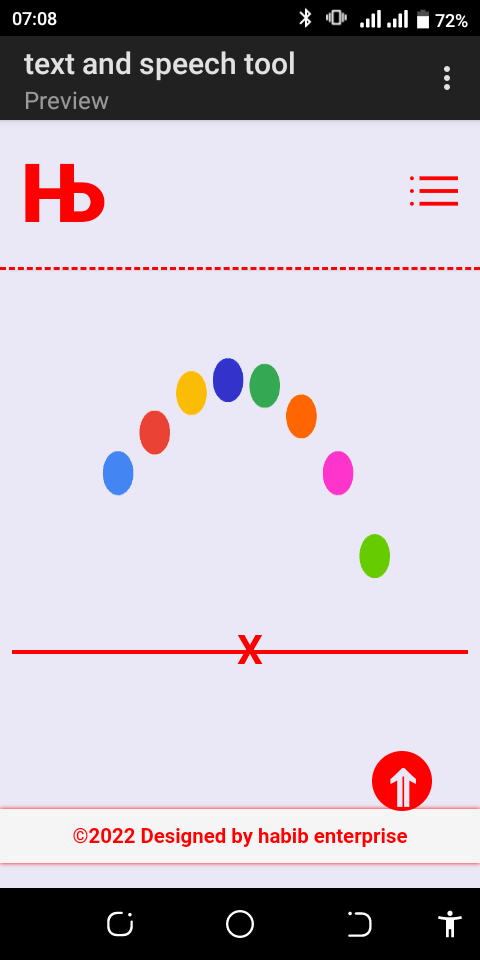

# Description

This is a text, image, and speech converter Pwa
it is optimised for both destop and mobile devices


# Is the app available offline
**Yes** 
the application can be installed directly from the website and most of the features are available offline .
**But**
for super fast performance its advisable to use the app online


## Features
- image to speech converter
- image to text converter
- speech to text converter
- text to speech converter


## What it utilizes
it ustilizes the following apis:
- web speech api
- speechsynthesis api
- tesseract ocr api

## Liberaries and Frameworks used

* React.js
* node.js
* express.js
* multer.js
* tesseract.js
* cluster


## Installation


```bash
git clone [the repo url]
```

## Usage

```bash
#install the dependencies
npm install

# run the server
npm start
```
The app will be listening on port `8080`

# Preview
you can visit the [live demo](speechtools.vercel.app)

> Cool loading Feature



## Contributing
Pull requests are welcome. For major changes, please open an issue first to discuss what you would like to change.

Please make sure to update tests as appropriate.

## License
[MIT](https://choosealicense.com/licenses/mit/)
